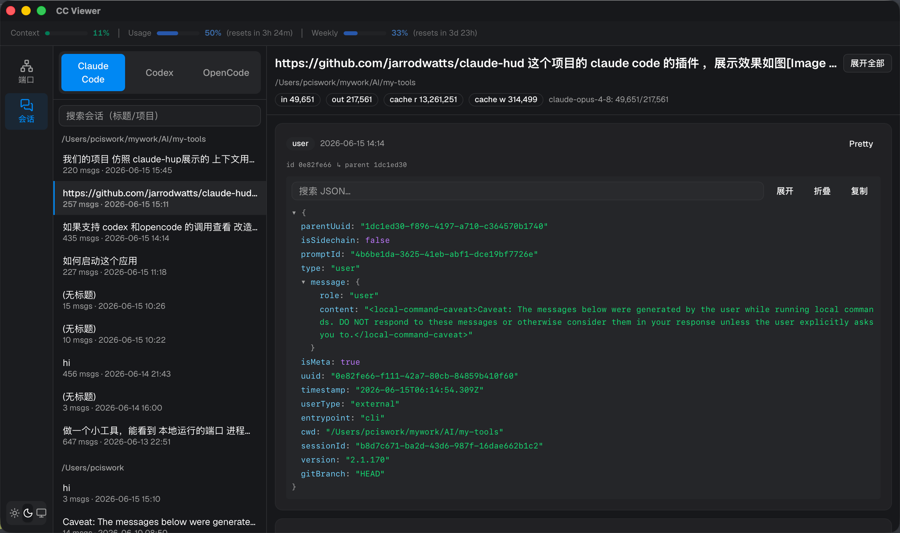

# CC Viewer

> 一个跨平台桌面工具：本地端口管理 + Claude Code / Codex / OpenCode 会话查看器 + 实时用量 HUD 状态条。

<p align="center">
  
  
  
  
  
</p>

CC Viewer 用 [Tauri 2](https://v2.tauri.app/) + React 19 构建，单一原生窗口里集成三件常用工具：

1. **端口管理** —— 看谁占了端口，一键 kill。
2. **会话查看器** —— 本地浏览 Claude Code、Codex、OpenCode 三家 CLI 的历史会话。
3. **用量 HUD** —— 顶部常驻状态条，镜像 claude-hud 的 `Context% / Usage 5h% / Weekly%`，按阈值变色。

---

## 📸 截图

### 会话查看器 + 用量 HUD



> 顶部 HUD 三段阈值色；左栏三源切换 + 按项目分组的会话列表；右栏消息时间线（Pretty / Raw JSON 双视图）与 token 统计。

---

## ✨ 功能特性

### 端口管理
- 列出所有监听端口：端口、进程名、PID、工作目录（cwd）、运行时长。
- 同一 PID 多端口树形聚合，IPv4 / IPv6 去重，用户进程优先排序。
- 按端口 / 进程名 / 路径搜索。
- 二次确认弹窗后 kill 进程。
- 可开关的自动刷新（3s 轮询）。

### 会话查看器（三源统一）
- **Claude Code** —— 解析 `~/.claude/projects/*/*.jsonl`。
- **Codex** —— 解析 `~/.codex/sessions/**/rollout-*.jsonl`。
- **OpenCode** —— 只读 SQLite `~/.local/share/opencode/opencode.db`（`mode=ro&immutable=1`，不抢 WAL 锁）。
- 来源分段切换；会话按项目分组、可搜索。
- 消息时间线：按 `parentUuid` 还原树形（分支/旁支），thinking、工具调用可折叠，Pretty / Raw 双视图。
- Token 统计（含按 model 分组）。
- `redacted_thinking` 显示加密占位。

### 用量 HUD 状态条
- 顶部全宽常驻：`Context% | Usage 5h% | Weekly%`，带 reset 倒计时。
- **阈值着色**（复刻 claude-hud）：
  - Context：`<70` 绿 / `≥70` 黄 / `≥85` 红
  - Usage·Weekly（配额）：`<75` 蓝 / `≥75` 品红 / `≥90` 红
- 数据来自 Claude Code 喂给 statusLine 的 stdin —— 仓库自带 statusline helper（`cc-viewer-statusline`），零外部依赖，原子写 `~/.claude/cc-viewer-usage.json`，前端 30s 轮询。
- 该 snapshot 文件格式兼容 claude-hud 的 `externalUsagePath`。

### 其它
- light / dark / system 三态主题（跟随系统、本地持久化）。
- cc-switch 风扁平设计，蓝色主色，shadcn/ui 组件。

---

## 🧱 技术栈

| 层 | 技术 |
|----|------|
| 桌面框架 | Tauri 2.x |
| 后端 | Rust（netstat2、sysinfo、rusqlite(bundled)、chrono、serde、dirs） |
| 前端 | React 19 · TypeScript · Vite 7 |
| UI | TailwindCSS v4 · shadcn/ui · lucide-react · sonner |
| 状态 | TanStack Query v5 |
| 测试 | vitest · @testing-library/react · cargo test |

---

## 📊 数据源准备

会话查看器需要对应 CLI 工具的数据。三个来源均为可选：只装/用你需要的。

### Claude Code（官方）
- **安装**: `npm install -g @anthropic-ai/claude-code`
  - macOS: `brew install anthropics/claude/claude-code` (可选)
  - 文档: https://github.com/anthropics/claude-code/
- **数据位置**: `~/.claude/projects/` 下各子目录的 `*.jsonl` 文件
- **何时产生**: 每次运行 Claude Code 会话自动记录

### Codex（Google）
- **安装**: https://github.com/google/codex
- **数据位置**: `~/.codex/sessions/**/rollout-*.jsonl`
- **何时产生**: Codex CLI 使用时自动保存

### OpenCode（Google）
- **安装**: https://github.com/google/opencode
- **数据位置**: `~/.local/share/opencode/opencode.db` (SQLite)
- **何时产生**: OpenCode 使用时自动生成数据库
- **注意**: CC Viewer 只读此 DB，不修改（`mode=ro&immutable=1`）

---

## 🚀 快速开始

### 前置依赖（构建本项目用）
- [Node.js](https://nodejs.org/) ≥ 18
- [Rust 工具链](https://rustup.rs/)（stable）
- Tauri 2 的系统依赖：参见 [官方前置说明](https://v2.tauri.app/start/prerequisites/)（macOS 需 Xcode Command Line Tools）

### 可选: 安装数据源 CLI 工具
若要查看历史会话，至少装一个（见上面"数据源准备"）。CC Viewer 会自动识别已装的工具并展示数据。

### 安装与开发

```bash
git clone https://github.com/mjbin888/cc-view.git
cd cc-view

# 安装前端依赖
npm install

# 开发模式（热更新，自动起 Rust 后端）
npm run tauri dev
```

### 构建生产包

```bash
npm run tauri build
# 产物在 src-tauri/target/release/bundle/
```

### 测试

```bash
# 前端单测
npm run test -- --run

# Rust 单测
cd src-tauri && cargo test
```

---

## 🛰️ HUD statusline 安装（用量数据源）

`Usage 5h%` / `Weekly%` 只能从 Claude Code 传给 statusLine 的 stdin 拿到，所以需把自带 helper 设为 statusLine（替代 claude-hud；其终端输出已镜像三段 bar）：

```bash
# 1. 编译 helper
cd src-tauri && cargo build --release --bin cc-viewer-statusline
# 产物：src-tauri/target/release/cc-viewer-statusline

# 2. 备份现有配置
cp ~/.claude/settings.json ~/.claude/settings.json.bak-hud

# 3. 把 ~/.claude/settings.json 的 statusLine 改为绝对路径：
#    "statusLine": {
#      "type": "command",
#      "command": "/绝对路径/cc-view/src-tauri/target/release/cc-viewer-statusline"
#    }
```

开一个 Claude Code 会话验证：终端出现三段彩色 bar，且生成 `~/.claude/cc-viewer-usage.json`。CC Viewer 顶部 HUD 即开始显示实时数据。

> 注：snapshot 只在 Claude Code 重绘 statusLine（即有活动）时刷新；空闲超过 `FRESHNESS_SECS`（默认 600s）视为陈旧，HUD 保留阈值颜色但整段降透明。

恢复原 statusLine：`cp ~/.claude/settings.json.bak-hud ~/.claude/settings.json`。

---

## 📁 项目结构

```
cc-view/
├── src-tauri/                      # Rust 后端
│   ├── src/
│   │   ├── commands/
│   │   │   ├── ports.rs            # list_ports / kill_port
│   │   │   ├── conversations.rs    # 三源派发：list_sessions / read_session
│   │   │   ├── codex.rs            # Codex rollout 解析
│   │   │   ├── opencode.rs         # OpenCode SQLite 解析
│   │   │   └── usage.rs            # read_usage_snapshot
│   │   ├── snapshot.rs             # UsageSnapshot 共享类型 + 原子读写
│   │   ├── bin/
│   │   │   └── cc-viewer-statusline.rs  # statusLine helper（写 snapshot + 终端渲染）
│   │   └── lib.rs                  # 注册命令
│   └── Cargo.toml
├── src/                            # React 前端
│   ├── views/                      # PortsView / ConversationsView
│   ├── components/                 # HudBar / HudMeter / SessionList / MessageTimeline …
│   ├── hooks/                      # usePorts / useSessions / useUsageSnapshot …
│   ├── lib/                        # 纯函数：groupPorts / buildMessageTree / aggregateUsage …
│   ├── contexts/                   # ThemeProvider
│   ├── types/                      # port / conversation / usage
│   └── test/                       # vitest
└── docs/                           # 设计文档（spec / plan）
```

### 数据流（HUD）

```
Claude Code ──stdin JSON──▶ cc-viewer-statusline ──原子写──▶ ~/.claude/cc-viewer-usage.json
                                    │                              │
                              终端渲染三段 bar              read_usage_snapshot (Tauri)
                                                                   │
                                                       useUsageSnapshot (30s) ──▶ HudBar
```

---

## 🤝 贡献

新功能模块在 `src-tauri/src/commands/` 下新建文件；前端组件放 `src/components/`，hook 放 `src/hooks/`，纯逻辑放 `src/lib/` 并配 vitest 测试。提交前确保 `npm run test -- --run` 与 `cargo test` 全绿。

## 📄 许可证

MIT
